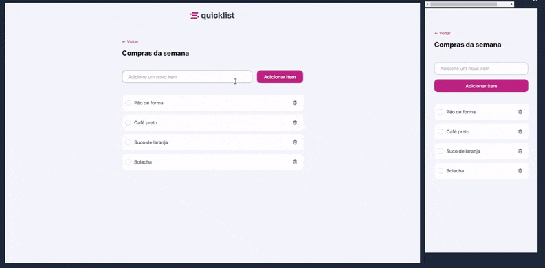

# 🗹 Quicklist 🗹
Desafio prático desenvolvido durante Formação Full-Stack promovida pela Rocketseat.
___
## 📲 Layout direcionado para aplicação de checklist
  

  
___
### 🤖 Tecnologias e Recursos  
  
* HTML
* CSS
* JavaScript
* Git
* Figma
* Notion
* Responsively App

#### 🔎 Você pode conferir o resultado clicando [aqui](https://arturtinoco.github.io/quicklist/) ou ver o projeto no [Figma](https://www.figma.com/community/file/1397279978314668489) feito por [Thiele Santana](https://www.linkedin.com/in/thielesantana/?original_referer=&originalSubdomain=br)  